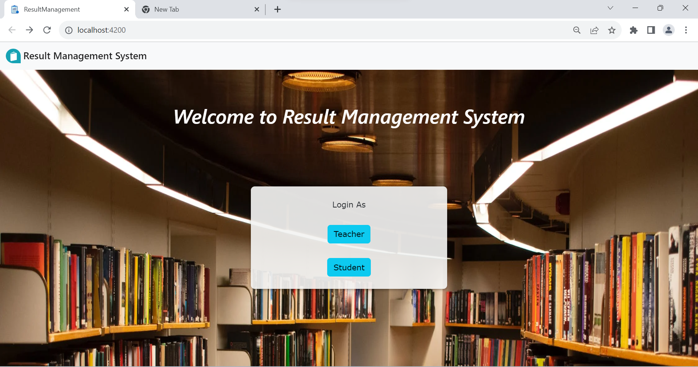

# ResultManagement

#### A Result Management System | Technology Stack : Angular + JSON Server
  
The system allows two types of users, teachers and students, to login. Teachers can view results of all the students, add new records, edit or delete existing records. Students can login to view their results by entering their roll no. and name.

## Backend

Run `json-server --watch db.json` to implement mock REST APIs using JSON Server that will run at `http://localhost:3000/`. 
To know more anout implementing queries on JSON Server, go to https://github.com/typicode/json-server
The data has been provided in db.json  as `details/`(students' results) and `users/`(teacher login).

## Frontend
Run `ng serve` for a dev server. Navigate to `http://localhost:4200/`. The app will automatically reload if you change any of the source files.
### Home Component.

